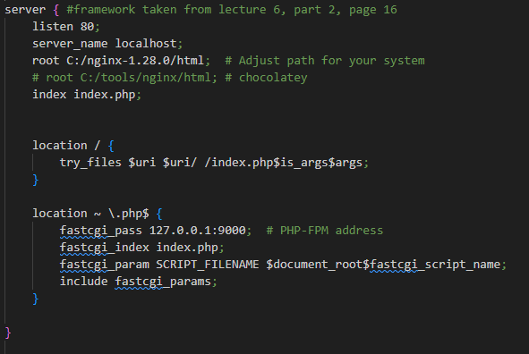
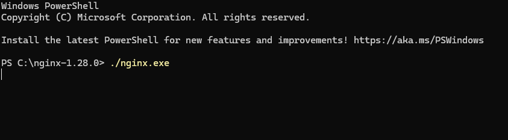

# Setting up my APIs with NGINX, PHP, and MySQL

Eurydice Lunnemann

---
## NGINX
- make sure you have NGINX installed in your C drive
- make sure your nginx.conf file server block matches the one shown below:

---
- next, open a terminal in your NGINX folder
- run "./nginx.exe" to start your server

---
## PHP
- make sure you have php installed in your C drive
- run ".\php-cgi.exe -b 127.0.0.1:9000 -c C:\php\php.ini" to start your php server
- php traffic should automatically be routed to this server because of the NGINX config
---
## MySQL
- make sure your MySQL service is running as MySQL80
- either through the GUI or CLI, add the following schemas and tables
    - public_apis
        - announcements (id, announcment, location, date_announced)
        - arts (id, name, size, artist)
        - audios (id, name, size, metadata)
        - candidates (id, name, votes, position)
        - dates (id, day, time, event)
        - grades (id, name, Math, English, Social_Studies)
---
- continued
    - public_apis continued
        - iot_devices (id, device_type, device_description, is_online)
        - stock_tickers (ticker_symbol, full_name, market_value, is_up)
    - private_apis
        - employees (id, name, tenure, department)
        - homeworks (id, name, questions, class)
---
## Finishing and Acknowledgement
- assuming you set up all of your services correctly, you should be able to use my APIs seamlessly
- Acknowledgement: much of the content in these slides is a shortened version of content that can be found [here](https://github.com/nkuase/ase230/tree/main/module1/lecture)